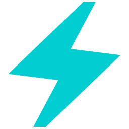

# Fun Street Web App

**Next.js serverless PWA with Firebase for College Festival Game Zone Management**

## Overview
The Fun Street web app is designed to manage a college festival's interactive game zone where users can register, earn tokens, scan QR codes to play games, recharge tokens, and track their rankings on a leaderboard. The app is minimalistic, real-time, mobile-friendly, and offline-capable, ensuring seamless event management with limited backend dependency.

## Tech Stack

### Frontend (User & Admin Panel)
- **Next.js** – React-based framework for fast, optimized web apps
- **Tailwind CSS** – Lightweight, responsive UI styling
- **React-QR-Reader** – Handles QR scanning from user devices

### Backend (Minimal, Real-time Data Management)
- **Firebase Firestore** – NoSQL database for real-time updates
- **Firebase Authentication** – Manages user and admin login
- **IndexedDB** (Browser Storage) – Enables offline functionality

### Hosting & Deployment
- **Vercel** – For fast, serverless deployment

### Other Integrations
- Dynamic & Static QR Codes – Used for game booths
- Local Storage / IndexedDB – Supports offline mode

## Features Breakdown

### 1. User Registration & Token System
- Users pay ₹100 and receive 100 tokens for playing games
- Assigned a unique QR code (User ID) for tracking
- System maintains name, phone number, tokens, and games played in Firestore

### 2. Game Booths & QR Code System
- Each game booth has a printed static QR code
- When scanned, it deducts tokens based on the game's cost
- If user doesn't have enough tokens, it prompts them to recharge

### 3. Recharge System
- Users visit an admin desk to manually recharge tokens after paying cash
- Admin updates their balance in the system

### 4. Real-Time Leaderboard
- Displays the top players based on games played
- Updates dynamically as users engage in more games

### 5. Offline Mode (IndexedDB Support)
- Users can scan QR codes even if the network is down
- Token balance and scan history are stored locally
- Syncs with Firestore once the internet is back

## User & Admin Flow

### User Flow
1. Registers & Pays ₹100 → Gets a unique User QR Code
2. Scans Game Booth QR Code → Tokens are deducted accordingly
3. Runs Out of Tokens? → Visits Admin Desk for Recharge
4. Plays More Games → Leaderboard Updates in Real-Time

### Admin Flow
1. Handles New Registrations – Adds users manually
2. Manages Recharges – Updates user tokens on payment
3. Monitors Player Activity – Tracks games played & balances
4. Oversees Leaderboard – Ensures fair play & engagement

## Why This Approach?
- ✅ Lightweight & Fast – Minimal backend dependency
- ✅ Works Offline – Ensures smooth experience
- ✅ Admin-Friendly – Manual recharge keeps it simple
- ✅ Scalable – Can handle multiple game booths
- ✅ Mobile-Optimized – Works as a web app for ease of use

---

# Development Guide

## How to use

Clone this repository:

    git clone https://github.com/prajein/funstreet-gdg.git
    cd funstreet-gdg

Remove the `.git` folder since you want to create a new repository

    rm -rf .git

Install dependencies:

    yarn  # or npm install

At this point, you need to [set up Firebase Firestore, see below](#set-up-firebase-database-firestore).

When Firebase is set up, start the web app by:

    yarn dev

In production:

    yarn build
    yarn start

If you navigate to `http://localhost:3004/` you will see a web page with a list of articles (or an empty list if you haven’t added one).

## Modifying the app to your needs

### Change app name and description

- Do search/replace for the `name`’s “Next.js Firebase PWA”, “nextjs-pwa-firebase-boilerplate” and `description` “Next.js serverless PWA with Firebase and React Hooks” to something else.
- Change the `version` in `package.json` to `0.1.0` or similar.
- Change the `license` in `package.json` to whatever suits your project.

### Renaming “Article” to something else

The main database item is called `Article`, but you probably want something else in your app.

Rename the files:

    git mv hooks/useArticles.tsx hooks/use{NewName}s.tsx

    mkdir -p components/{newName}s
    git mv components/articles/CreateArticleForm.tsx components/{newName}s/Create{NewName}Form.tsx
    git mv components/articles/ArticleDetails.tsx components/{newName}s/{NewName}Details.tsx
    git mv components/articles/ArticleList.tsx components/{newName}s/{NewName}List.tsx
    git mv components/articles/ArticleListItem.tsx components/{newName}s/{NewName}ListItem.tsx
    rm -r components/articles

    mkdir pages/{newName}s
    git mv "pages/articles/[slug].tsx" "pages/{newName}s/[slug].tsx"
    rm -r pages/articles

Then, do search/replace inside the files for different casing: `article`, `Article`, `ARTICLE`.

### Change port number

Do search/replace for `3004` to something else.

### Set up Firebase database (Firestore)

Set up the database (if you don’t need a database, see “How to remove/replace Firebase as database” below):

1. Go to https://console.firebase.google.com/ and create a new project, a new web app, and a new Cloud Firestore database.
2. Copy the `firebaseConfig` (from when setting up the Firebase web app) to `lib/data/firebase.ts`
3. Edit the `.env.local` file, setting the `NEXT_PUBLIC_FIREBASE_API_KEY` value.

### How to remove the Firebase dependency

- Run `yarn remove firebase`
- Delete `lib/data/firebase.ts` and modify `hooks/useArticles.tsx`.

### Replace Firebase with Postgres SQL

- Use a Postgres hosting provider (e.g. https://www.elephantsql.com/)
- Use [`createSqlRestRoutesServerless` in `sql-wizard`](https://github.com/tomsoderlund/sql-wizard#creating-rest-routes-serverless-eg-for-nextjs-and-vercel) to set up your own API routes.

### Replace Firebase with Supabase (Postgres SQL, real-time updates)

- Remove Firebase: `yarn remove firebase`
- Add Supabase: `yarn add @supabase/supabase-js`
- Add `NEXT_PUBLIC_SUPABASE_API_KEY` to `.env.local`
- Create a `lib/data/supabase.ts`:
```
import { createClient } from '@supabase/supabase-js'
const supabaseUrl = process.env.NEXT_PUBLIC_SUPABASE_URL
const supabaseKey = process.env.NEXT_PUBLIC_SUPABASE_API_KEY
export const supabase = createClient(supabaseUrl, supabaseKey)
```
- Update the JS files that reference `lib/data/firebase`

### Change visual theme (CSS)

1. Change included CSS files in `pages/_app.tsx`
2. Change CSS in `public/app.css`
3. Change font(s) in `PageHead.tsx`
4. Change colors in `public/manifest.json`

### Login/Signup with Firebase Authentication

You need to enable Email/Password authentication in https://console.firebase.google.com/project/YOURAPP/authentication/providers

## Deploying on Vercel

> Note: If you set up your project using the Deploy button, you need to clone your own repo instead of this repository.

Setup and deploy your own project using this template with [Vercel](https://vercel.com). All you’ll need is your Firebase Public API Key.

[](https://vercel.com/import/git?s=https%3A%2F%2Fgithub.com%2Ftomsoderlund%2Fnextjs-pwa-firebase-boilerplate&env=NEXT_PUBLIC_FIREBASE_API_KEY&envDescription=Enter%20your%20public%20Firebase%20API%20Key&envLink=https://github.com/tomsoderlund/nextjs-pwa-firebase-boilerplate#deploying-with-vercel)